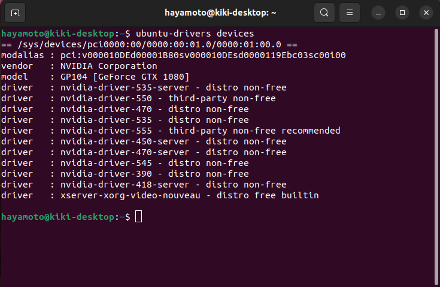
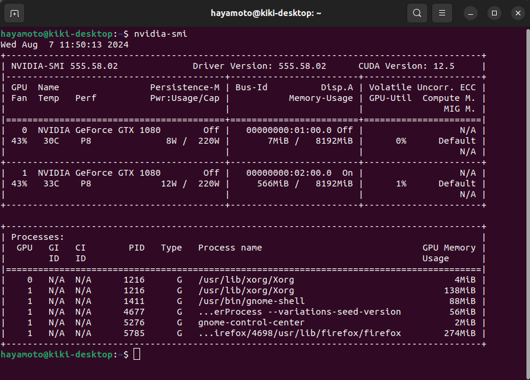
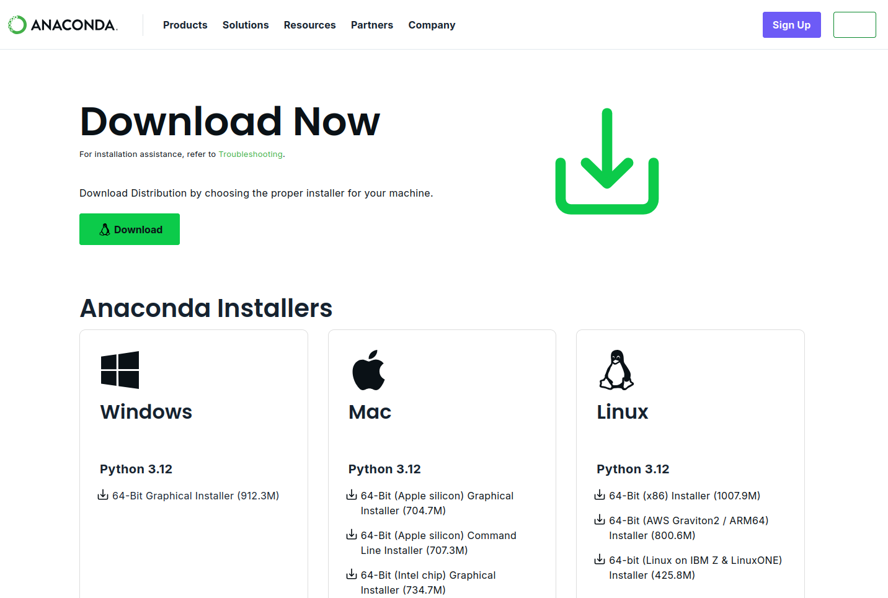

# 【入門】Anaconda3スターターパック

## 実行環境

- Ubuntu22.04

- vscode

## Nvidia-Driverを入れよう

### 事前準備

おまじないを実行

```java:ターミナル
sudo gedit /etc/modprobe.d/blacklist-nouveau.conf
```

ファイルを編集する画面が出るので以下をコピペ

```java:ターミナル
blacklist nouveau
options nouveau modeset=0
```

コピペしたら**Enter**

保存が完了したら以下を実行

```java:ターミナル
sudo update-initramfs -u
```

### 何のGPU使ってるのかな？

```java:ターミナル
lspci | grep -i nvidia
```

### 今入ってるNvidia-Driverを確認しよう

```java:ターミナル
dpkg -l | grep nvidia
```

### 一旦、Nvidia-Driver削除しよ

```java:ターミナル
sudo apt-get --purge remove nvidia-*
```

### 【重要】推奨バージョンの確認

```java:ターミナル
ubuntu-drivers devices
```

**recommended**と書かれているバージョンを確認

下の画像では**nvidia-driver-555**が選ぶもの



### aptでインストール

以下のコマンドでインストール

```java:ターミナル
sudo add-apt-repository ppa:graphics-drivers/ppa
sudo apt update
sudo apt install nvidia-driver-555 //ここの数字を変える
```

再起動しよ

```java:ターミナル
sudo reboot
```

再起動後、インストールされているか確認

```java:ターミナル
nvidia-smi
```

このような画面が出てくれば成功



## Anaconda3をインストールしよう

### Anacondaのサイトに移動する

[Anacondaダウンロードサイト](https://www.anaconda.com/download)

### Linux版をダウンロードする

右下の**Skip registration**をクリック


**Linux**の欄の**64-Bit(x86)Installer**をクリック



### ダウンロードしたファイルを実行する

- ターミナルに移動する

- ダウンロードしたファイルのがあるディレクトリに移動する

  多くの人はダウンロードディレクトリにある

    ```java:ターミナル
    cd ダウンロードディレクトリの名前
    ```

- コマンドで実行する

  ```java:ターミナル
  bash ダウンロードしたファイル名.sh
  ```

  例

  ```java:ターミナル
  bash Anaconda3-2024.06-1-Linux-x86_64.sh
  ```

- 実行中の選択肢

  ```java:ターミナル
  # 以上略(利用規約がツラツラ書いてあるのでEnter長押し)
  >>> yes

  # 以上略(どこにAnaconda3フォルダを作るか。デフォルトでOK)
  >>> [Enterを押す]

  # 以上略(おまじないみたいなもの)
  >>> yes
  ```

- ダウンロードされたかの確認

  デフォルトでは**homeディレクトリ**にできるのでそこを確認し**anaconda3**があればOK

## インストール後の設定

トリセツのフォルダ内のものを確認

## 参考文献

[ubuntuにCUDA、nvidiaドライバをインストールするメモ](https://qiita.com/porizou1/items/74d8264d6381ee2941bd)

[UbuntuでAnacondaを利用したい](https://yu-ton-channel.hatenablog.com/entry/2023/04/28/155545)
