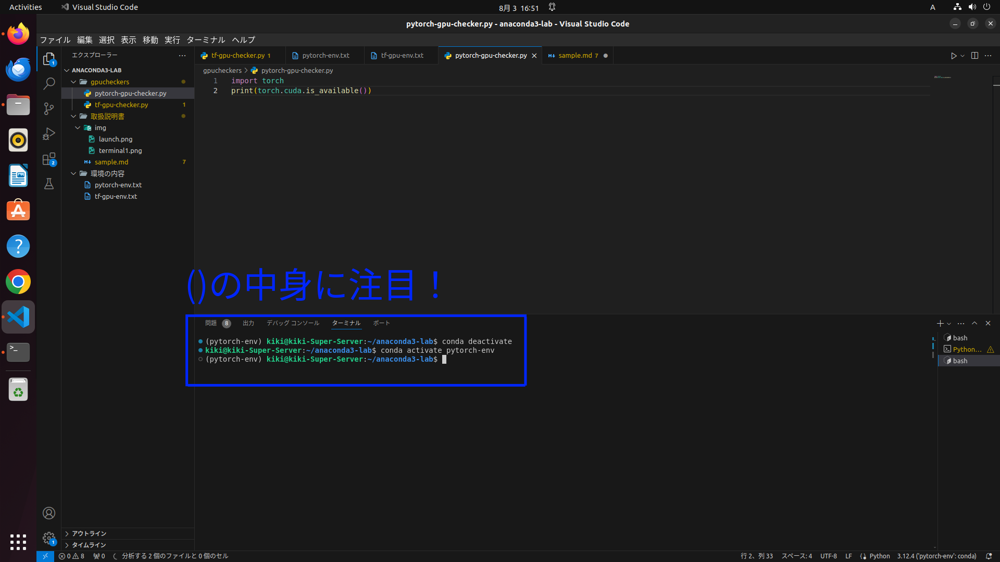

# Anaconda3の使い方

## 1. 新しい仮想環境の作り方

Anacondaは自分で環境を分けることができるのが便利ポイント.  
TensolflowやPytorchなど使うライブラリやバージョンごとに環境を分けて作っておこう！

- ターミナルを開く（Ctrl + Alt + T）

  
  
- コマンドを打つ  
  
  注意：**環境名は必ず英語！**

  - pythonのバージョンを指定しない場合
  
     ```java:ターミナル
     conda create -n 環境名
     ```

  - pythonのバージョンを指定する場合

     ```java:ターミナル
     conda create -n 環境名 python=バージョン
     ```

  - 例

     ```java:ターミナル
     conda create -n tf-gpu-env python=3.9
     ```

## 2. 現在の仮想環境の確認

Anacondaにあるすべての環境が表示されるぞ！

- コマンドを打つ

     ```java:ターミナル
     conda info -e
     ```

## 3. 仮想環境の削除方法

いらないものは消して整理整頓！

- コマンドを打つ

     ```java:ターミナル
     conda remove -n 環境名 --all
     ```

## 4. 仮想環境の起動と実行

使えるようになって初めて意味がある！

pythonファイルとJupyterノートブックで少し違うので注意

個人的にはvscodeが便利だからおすすめ！

### vscodeでpythonファイルを実行するパターン

- vscodeを開く
- 下の図に従って使う環境を選び、起動できたら右上のボタンを押す

    

### terminalでpythonファイルを実行するパターン

- ターミナルを開く

- コマンドで今使用している環境を閉じる
  
    ```java:ターミナル
    conda deacitvate
    ```

- 使いたい環境を起動する

    ```java:ターミナル
    conda acitvate 環境名
    ```

- 例
  
    ```java:ターミナル
    conda deactivate
    conda acitvate pytorch-env
    ```

    

起動できたらコマンドで実行

```java:ターミナル
python3 ファイル名.py
```

vscodeでターミナルを開けば、環境はvscodeの機能で選んで実行はターミナルにコマンドを打つという方法もできる

右上のボタンで上手くいかなかったらターミナルも使おう

### vscodeでJypyterノートブックを実行するパターン

- vscodeを開く
- 下の図に従って使う環境を選び、起動できたらセルを実行する

    

## 5. 仮想環境内の設定

トリセツ内の**環境設定詳細.pdf**を確認

## 6. 参考文献

詳しい内容は下のURLをチェック！

[【初心者向け】Anacondaで仮想環境を作ってみる](https://qiita.com/ozaki_physics/items/985188feb92570e5b82d)
